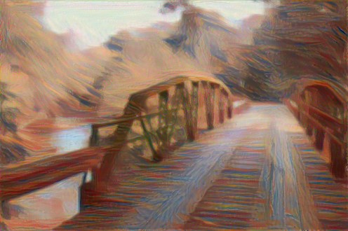
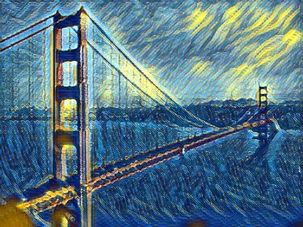

# starry-nAIght

Team Member: Zhuoyu Feng, Jinxuan Tang, Katie Jiang, Isabella Lu, Noah Hung, Srikar Vemuri

## Project Overview:

AI generated art can take numerous minutes to generate, primarily due to online traffic. Other AI art generators require users to pay for the entirety of the functionality or bombard the user with advertisements. Our goal is to provide users with a free, easy access art generator that’ll apply the styles of famous artists such as Picasso, Monet, and Van Gogh to their uploaded images. Methods that we used to achieve this goal includes: Style Transfer and GAN.

## Style Transfer

### Methodology

1. The first method is first published in [A Neural Algorithm of Artistic Style](https://arxiv.org/abs/1508.06576). The style transfer algorithm used convolutional neural networks to extract the “style” from one image and apply it to another. To perform the style transfer, two images are fed through this VGG-19 network: the “content” and the “style”. A third image is created which tries to minimize the difference between the intermediate layers of the VGG-19 when both images are fed through. It provides a relatively controllable way to generate art. 
2. The second method we tried is published in [Multi-style Generative Network for Real-time Transfer](https://arxiv.org/pdf/1703.06953). This is based on feed-forward generative network for multi-style or arbitrary-style transfer method, and it introduced CoMatch Layer that learns to match the second order feature statistics with the target styles. In this way, the image generated by MSGnet maintains the image's quality as well as the flexiblity of the model. To apply the model, it also takes two input images: one is content, another is style image, and the third image produced by the model.

### Example

- For the style transfer using VGG19, we provide a brief example of applying Edvard Munch's [**the Scream**](style_transfer/images/the_scream.jpg) to a photo of [Sipsey river bridge](style_transfer/images/sipsey_river_bridge.jpg).

- For second method, here is an example generated by the MSGnet model. It applying Van Gogh's [The Starry Night](style_transfer/images/Starry_Night.jpg) to a photo of [Golden Gate Bridge](style_transfer/images/golden_gate_bridge.jpg).

